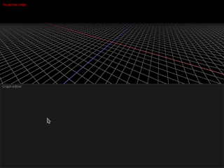

# Blackjack
> Your Rusty 🦀 procedural modeller

**Blackjack** is a procedural modelling application, following the steps of great tools like [Houdini](https://www.sidefx.com/) or [Blender's geometry nodes project](https://docs.blender.org/manual/en/latest/modeling/geometry_nodes/index.html). At its core, Blackjack is a simple node-driven interface where you can compose operations to create a 3d mesh in a non-destructive way.

## Features and goals
Blackjack **does not aim to replace an industry powerhouse such as Houdini**. Instead, it aims to provide a less cluttered, more robust and user-friendly experience for a small subset of the features that make these tools a great fit in the world of game development and real-time simulations.

Here are the main goals and philosophy behind blackjack, but note that this shows the direction where things are going, not their current state.

- **Procedural polygonal modelling, first and foremost**: The main focus in Blackjack is the creation of low-poly procedural assets like the ones one would see in videogames. In particular, surface extraction of volumetric data is not among its goals.
- **Flexible node-based interface:** Build complex node graphs, create reusable functions, and tweak every parameter in real-time!
- **Integration with popular game engines:** Export your procedural assets as tiny programs and tweak their parameters at runtime by adding a simple library to your engine of choice.
- **Error resilience, crash resistance:** When things go wrong, Blackjack will make an effort to *respect your time* as a user and not lose your work. Errors will be clearly communicated and fixing any bugs leading to a crash will take the highest priority.

## Tech stack
Blackjack is built using Rust 🦀 and stands on the shoulders of giants. Here's a shout out to some great rust crates being used in this project:

- [rend3](https://github.com/BVE-Reborn/rend3) is used for all rendering purposes.
- [egui](https://github.com/emilk/egui) is used as the UI toolkit powering all 2d interaction.
- [wgpu](https://github.com/gfx-rs/wgpu), as the base of `rend3`, is used for all custom visual effects.

## Tool Maturity
Blackjack is still under active development. Many features are missing and are bound to change. For now, **no promises are made with regards to stability**, but API breakage will be considered only when absolutely necessary.

## Contributing
Contributions are welcome! Before writing a PR, please get in touch by filing an issue 😄
