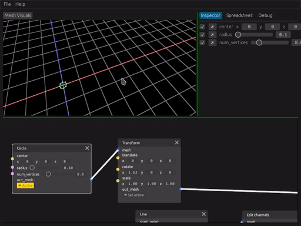

<p align="center">
  
</p>

> Your Rusty 🦀 procedural 3d modeler


**ARCHIVED REPOSITORY** This repository is now archived because of a variety of technical and political reasons that made me loose my motivation to continue contributing to the Rust community in my free time.

**Blackjack** is a procedural modelling application, following the steps of great tools like [Houdini](https://www.sidefx.com/) or [Blender's geometry nodes project](https://docs.blender.org/manual/en/latest/modeling/geometry_nodes/index.html). At its core, Blackjack is a simple node-driven interface where you can compose operations to create a 3d mesh in a non-destructive way.





## Features and goals
Blackjack **does not aim to replace an industry powerhouse such as Houdini**. Instead, it aims to provide a less cluttered, more robust and user-friendly experience for a small subset of the features that make these tools a great fit in the world of game development and real-time simulations.

Here are the main goals and philosophy behind blackjack, but note that this shows the direction where things are going, not their current state.

- **Procedural polygonal modelling, first and foremost**: The main focus in Blackjack is the creation of low-poly procedural assets like the ones one would see in videogames. In particular, surface extraction of volumetric data is not among its goals.
- **Flexible node-based interface:** Build complex node graphs, create reusable functions, and tweak every parameter in real-time!
- **Integration with popular game engines:** Export your procedural assets as tiny programs and tweak their parameters at runtime by adding a simple library to your engine of choice.
- **Error resilience, crash resistance:** When things go wrong, Blackjack will make an effort to *respect your time* as a user and not lose your work. Errors will be clearly communicated and fixing any bugs leading to a crash will take the highest priority.

## Install and usage
> **Note**: A crates.io version cannot be published due to unreleased dependencies. Blackjack depends on the bleeding edge version of some crates and requires custom forks for some others. This situation may change once development stabilizes.

Here are the steps in order to try out the early development version of Blackjack. Binaries and easier installation methods will be provided in the future. The steps below require a complete Rust toolchain using `cargo`, with a minimum supported Rust version (MSRV) of **1.62.0**.

1. Clone this repository, and make sure to download LFS files. In some systems, this may require separately installing a `git-lfs`[^1] package:
```bash
git clone https://github.com/setzer22/blackjack
git lfs install
git lfs fetch --all
git lfs pull
```

[^1]: Linux users can install `git-lfs` with their distro's package manager (`apt install git-lfs` / `yum install git-lfs` / `pacman -S git-lfs`). MacOS users using homebrew can use `brew install git-lfs`. Other users should follow the [git-lfs install instructions](https://git-lfs.github.com/).

2. Install build dependencies. This may not cover everything, please file an issue or a pull request if you find anything missing:
   * Ubuntu/Debian: `sudo apt install libfontconfig-dev`
   * Arch Linux: `sudo pacman -S fontconfig`
   * Fedora: `sudo dnf install fontconfig-devel`
> **Note**: The `fontconfig` native dependency is temporary, and will no longer be necessary once this upstream issue is fixed: https://github.com/rust-windowing/winit/issues/2373

3. From the same folder, run `cargo run --release --bin blackjack_ui` to launch Blackjack.

### Usage
Some minimal usage instructions. Please do note that these can and will change frequently during early development:

- The bottom section of the screen is the node graph.
- Use right click to open the node selector. Find a node and spawn it by clicking on it. You can also use the search bar.
- Nodes can be dragged around, and its widgets interacted with using the mouse.
- Dragging the mouse between two nodes' ports will create a connection.
- Use the 'Set active' button under a node to make it render to the screen.

## Tech stack
Blackjack is built using Rust 🦀 and stands on the shoulders of giants. Here's a shout out to some great rust crates being used in this project:

- [rend3](https://github.com/BVE-Reborn/rend3) is used for all rendering purposes.
- [egui](https://github.com/emilk/egui) is used as the UI toolkit powering all 2d interaction.
- [wgpu](https://github.com/gfx-rs/wgpu), as the base of `rend3`, is used for all custom visual effects.
- [mlua](https://github.com/khvzak/mlua) is used to integrate [Luau](https://github.com/Roblox/luau) as an extension language.

## Tool Maturity
Blackjack is still under active development. Many features are missing and are bound to change. For now, **no promises are made with regards to stability**, but API breakage will be considered only when absolutely necessary.

## Contributing
Contributions are welcome! Before writing a PR, please get in touch by filing an issue 😄


